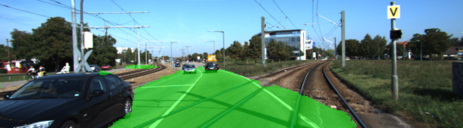
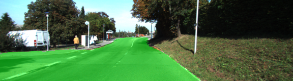
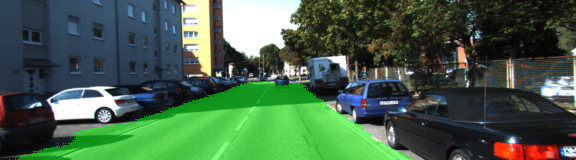

# Road Detection using FCN Semantic Segmentation 
## Introduction
This project implement Fully Convolutional Networks(FCN) for Semantic Segmentation neural network architecture to detect open space on the road/street in a given image using Python and Tensorflow. The neural network model is trained on Kitti Road dataset to classify image pixels into two classes "road" and "not road". 

## Implementation

### Model Architecture
The project follow the architecture from Berkeley's paper
[Fully Convolutional Networks for Semantic Segmentation](https://people.eecs.berkeley.edu/~jonlong/long_shelhamer_fcn.pdf). The network is mainly consist of two major components "encoder" and "decoder", which are  convolution neural network and transpose/de-convolution neural network, respectively. This application uses a pre-trained VGG-16 convolution neural network for the "encoder" portion to extract the image's features that will be fetched into the "decoder" portion to classify pixels while prevserving the spatial/dimension of the original image's size. The application apply a 1x1 convolution layer to the VGG-16's last layer (fully connected layer) in order to transition/connect the "encoder" layers to the "decoder" portion. The application implement "decoder" portion by create six pair of 1x1 convolution and tranpose convolution layers. The kernel/filter size of the transpose convolution layers are gradually increase by factor of two in order to bring the final tensor ouput to original image size/dimension.

### Code Structure
The application is compose of four core functions "load_vgg", "layers", "optimize", and "train_nn".

**load_vgg()** is responsible for loading the pre-trained VGG-16 model.

**layers()** is responsible for creating convolution and transpose convolution layers for the "decoder" portion using the tensor output from previous VGG-16 layers.

**optimize()** is responsible for creating neural network loss function and optimizer. Cross entropy is used for the loss function and Adam Optimizer is used for the optimizer.

**train_nn** is responsible for executing training steps.


### Model Training
The application uses the following hyperparameters to train the model:

-Keep probability: 0.5
-Learning rate: 0.00008
-Epochs: 30
-Batch size: 5

It takes about 15 minutes to train the model on a GPU device.

#### Results
The training with 30 epochs yield an average loss of about 0.004. 

Here are some sample images:







### Setup & Run Information
##### Frameworks and Packages
Make sure you have the following is installed:
 - [Python 3](https://www.python.org/)
 - [TensorFlow](https://www.tensorflow.org/)
 - [NumPy](http://www.numpy.org/)
 - [SciPy](https://www.scipy.org/)
##### Dataset
Download the [Kitti Road dataset](http://www.cvlibs.net/datasets/kitti/eval_road.php) from [here](http://www.cvlibs.net/download.php?file=data_road.zip).  Extract the dataset in the `data` folder.  This will create the folder `data_road` with all the training a test images.

##### Run
Run the following command to run the project:
```
python main.py
```
**Note** If running this in Jupyter Notebook system messages, such as those regarding test status, may appear in the terminal rather than the notebook.

 ### Tips
- The link for the frozen `VGG16` model is hardcoded into `helper.py`.  The model can be found [here](https://s3-us-west-1.amazonaws.com/udacity-selfdrivingcar/vgg.zip)
- The model is not vanilla `VGG16`, but a fully convolutional version, which already contains the 1x1 convolutions to replace the fully connected layers. Please see this [forum post](https://discussions.udacity.com/t/here-is-some-advice-and-clarifications-about-the-semantic-segmentation-project/403100/8?u=subodh.malgonde) for more information.  A summary of additional points, follow. 
- The original FCN-8s was trained in stages. The authors later uploaded a version that was trained all at once to their GitHub repo.  The version in the GitHub repo has one important difference: The outputs of pooling layers 3 and 4 are scaled before they are fed into the 1x1 convolutions.  As a result, some students have found that the model learns much better with the scaling layers included. The model may not converge substantially faster, but may reach a higher IoU and accuracy. 
- When adding l2-regularization, setting a regularizer in the arguments of the `tf.layers` is not enough. Regularization loss terms must be manually added to your loss function. otherwise regularization is not implemented.
 
